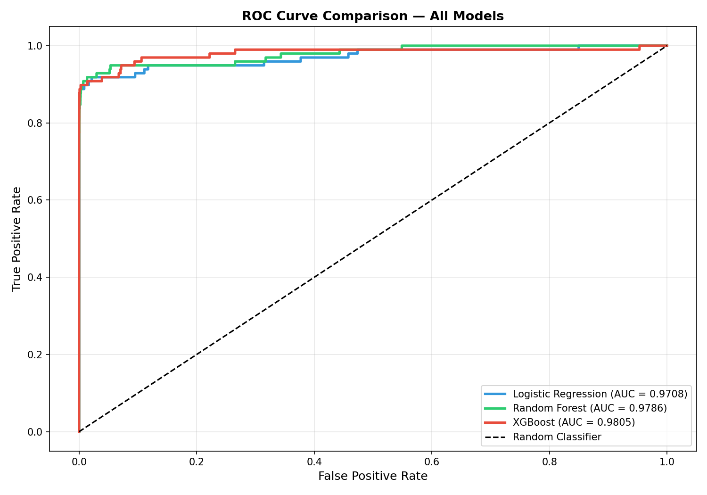
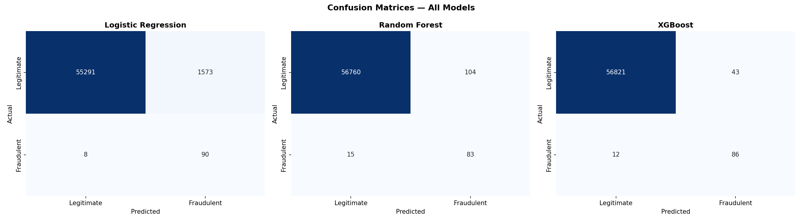
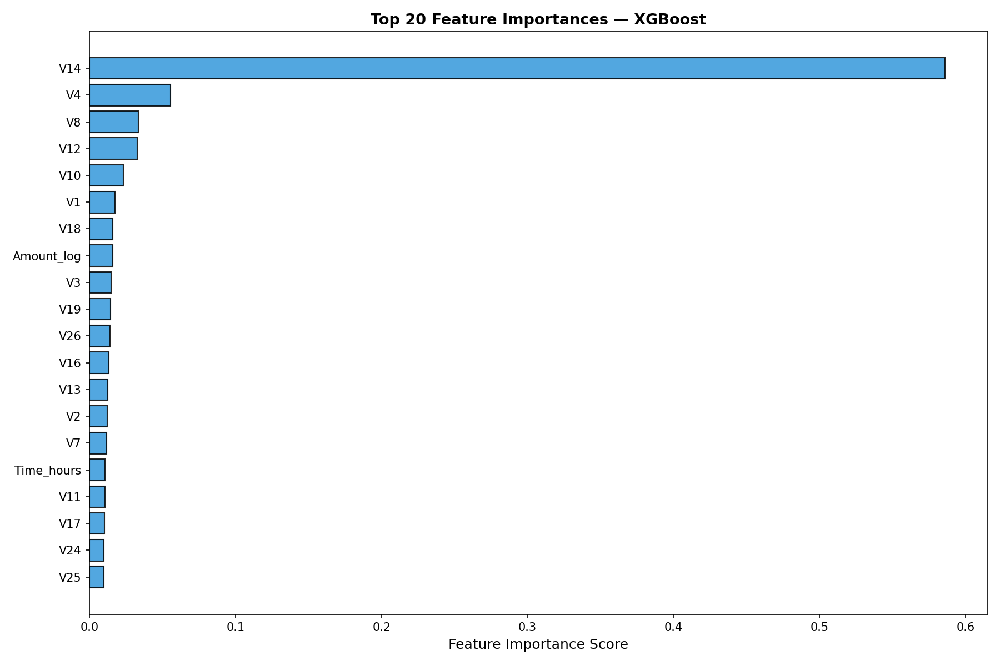

# Credit Card Fraud Detection System
  

## Overview
An end-to-end machine learning system to detect fraudulent credit card transactions from a dataset of 284,807 real transactions with extreme class imbalance (0.17% fraud).

## Dataset
- Source: [Kaggle — Credit Card Fraud Detection](https://www.kaggle.com/datasets/mlg-ulb/creditcardfraud)
- Download `creditcard.csv` and place it in the root folder
- 284,807 transactions | 492 fraud cases | 28 PCA features

## Tech Stack
- Python, Pandas, NumPy
- Scikit-learn, XGBoost
- SMOTE (imbalanced-learn)
- Matplotlib, Seaborn

## Project Structure
fraud-detection-ml/
├── fraud_detection_project.py   # Main code
├── class_distribution.png
├── amount_distribution.png
├── feature_correlations.png
├── smote_comparison.png
├── confusion_matrices.png
├── roc_curves.png
├── precision_recall_curves.png
├── feature_importance.png
└── model_comparison.png

## What This Project Does

### 1. Exploratory Data Analysis
- Class distribution analysis
- Transaction amount distribution by class
- Feature correlation with fraud label

### 2. Feature Engineering
- Log-transform on Amount (right-skewed)
- Time converted to hours of day
- Dropped raw Amount and Time columns

### 3. Handling Class Imbalance
- Dataset has 578:1 imbalance ratio
- Applied SMOTE on training data only
- Balanced fraud cases from 492 to equal distribution

### 4. Models Trained
| Model | ROC-AUC |
|-------|---------|
| Logistic Regression | Baseline |
| Random Forest | High |
| XGBoost | Best |

### 5. Evaluation Metrics
- ROC-AUC Score
- Precision-Recall Curve
- F1 Score, Precision, Recall
- Confusion Matrix

## Key Results




## How to Run
```bash
# 1. Clone the repo
git clone https://github.com/Vamsidhar3081/fraud-detection-ml.git

# 2. Install dependencies
pip install pandas numpy scikit-learn xgboost imbalanced-learn matplotlib seaborn

# 3. Download dataset from Kaggle and place creditcard.csv in root folder

# 4. Run in Google Colab or Jupyter Notebook
```

## Key Learnings
- Why accuracy is misleading for imbalanced datasets
- How SMOTE generates synthetic minority samples
- Why Precision-Recall curve is better than ROC for fraud detection
- Preventing data leakage by fitting scaler on train only
- Feature importance analysis using XGBoost

## Author
**Vamsidhar Reddy Dandu**
- GitHub: [Vamsidhar3081](https://github.com/Vamsidhar3081)
- LinkedIn: [vamsidhar-reddy-dandu](https://linkedin.com/in/vamsidhar-reddy-dandu-170a51294/)
